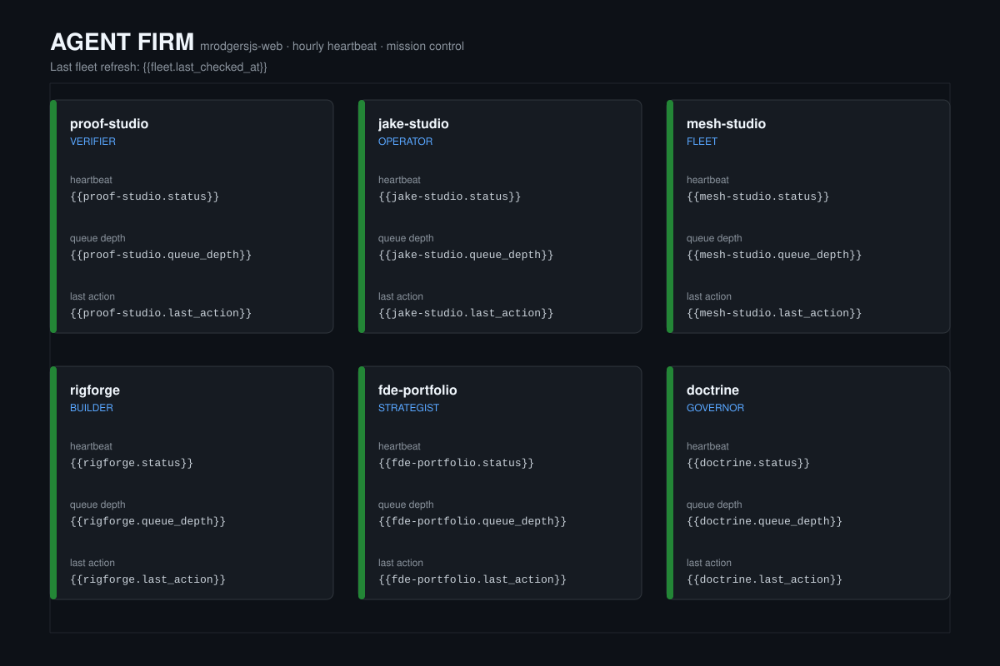

# agent-firm

A GitHub-native agent firm for [`mrodgersjs-web`](https://github.com/mrodgersjs-web).
Each repository owns one role, and this repository owns the heartbeat that
proves the firm is alive.




## The fleet

| Agent | Repo | Role | Verify |
| --- | --- | --- | --- |
| Verifier | [proof-studio](https://github.com/mrodgersjs-web/proof-studio) | Catch false "done" with signed ProofPackets | `scripts/smoke.sh` |
| Operator | [jake-studio](https://github.com/mrodgersjs-web/jake-studio) | Run closed-loop operator sessions | `scripts/smoke.sh` |
| Fleet | [mesh-studio](https://github.com/mrodgersjs-web/mesh-studio) | Probe, boot, and recover nodes | `scripts/smoke.sh` |
| Builder | [rigforge](https://github.com/mrodgersjs-web/rigforge) | Deterministic build and proof scaffolding | `scripts/smoke.sh` |
| Strategist | [fde-portfolio](https://github.com/mrodgersjs-web/fde-portfolio) | Discovery → eval → handoff playbooks | `scripts/smoke.sh` |
| Governor | [doctrine](https://github.com/mrodgersjs-web/doctrine) | Rules agents load before acting | `scripts/smoke.sh` |

Each agent is declared in [`agents/`](./agents/) and bound by the
[`CONSTITUTION.md`](./CONSTITUTION.md).

## How it works

1. **Spec** — `agents/<repo>.yaml` defines the agent's role, boundary, trigger,
   implementation, SLA, and heartbeat invariant.
2. **Heartbeat** — `.github/workflows/heartbeat.yml` runs hourly. It checks the
   invariant in each fleet repo, writes a status JSON, and regenerates the
   shields.io badge.
3. **Dashboard** — `dashboard.svg` is the mission-control template. Status
   JSONs live on the `heartbeat` branch for downstream renderers.
4. **Badge** — `scripts/generate-dashboard.sh` reads the status JSONs and emits
   `badge.json`, served from the `heartbeat` branch.

## Run the badge generator locally

```bash
# Create some sample status files
mkdir -p status
echo '{"repo":"proof-studio","status":"online"}' > status/proof-studio.json
echo '{"repo":"jake-studio","status":"online"}' > status/jake-studio.json

# Generate the endpoint badge
./scripts/generate-dashboard.sh status badge.json
cat badge.json
```

## Fork this firm

See [`CONSTITUTION.md`](./CONSTITUTION.md) for the full fork-and-instantiate
guide. The short version:

1. Copy this repository.
2. Edit `agents/*.yaml` and the matrix in `.github/workflows/heartbeat.yml`.
3. Enable Actions and push. The workflow will create the `heartbeat` branch on
   first run.
4. Point your profile README at the generated badge.

## License

MIT.
